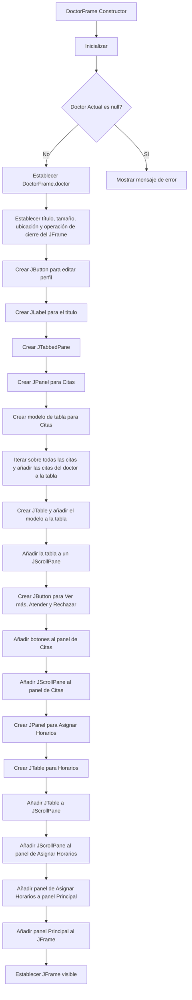

## Diagrama de PacienteFrame
    

```mermaid

graph TB
    A[DoctorFrame Constructor] --> B[Inicializar]
    B --> C{Doctor Actual es null?}
    C -- No --> D[Establecer DoctorFrame.doctor]
    D --> E[Establecer título, tamaño, ubicación y operación de cierre del JFrame]
    E --> F[Crear JButton para editar perfil]
    F --> G[Crear JLabel para el título]
    G --> H[Crear JTabbedPane]
    H --> I[Crear JPanel para Citas]
    I --> J[Crear modelo de tabla para Citas]
    J --> K[Iterar sobre todas las citas y añadir las citas del doctor a la tabla]
    K --> L[Crear JTable y añadir el modelo a la tabla]
    L --> M[Añadir la tabla a un JScrollPane]
    M --> N[Crear JButton para Ver más, Atender y Rechazar]
    N --> O[Añadir botones al panel de Citas]
    O --> P[Añadir JScrollPane al panel de Citas]
    P --> Q[Crear JPanel para Asignar Horarios]
    Q --> R[Crear JTable para Horarios]
    R --> S[Añadir JTable a JScrollPane]
    S --> T[Añadir JScrollPane al panel de Asignar Horarios]
    T --> U[Añadir panel de Asignar Horarios a panel Principal]
    U --> V[Añadir panel Principal al JFrame]
    V --> W[Establecer JFrame visible]
    C -- Sí --> X[Mostrar mensaje de error]
    

```